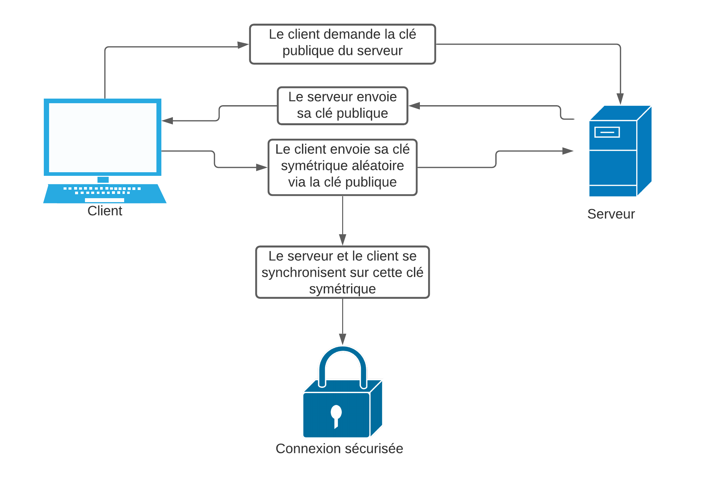

# Algorythme de chiffrement
## Principe
L'idée derièrre l'algorythme choisi est de s'inspirer du SSH afin d'obtenir une connexion portable, sécurisée, et peu couteuse en ressources.

Pour cela l'idée est d'établir une connexion via un chiffrement symétrique, car c'est rapide et peu coûteux en ressources. Cependant, afin de rester portable, il nous faut un moyen de communiquer cette clé au pair avec lequel on communique. Pour se faire, on initialise la connexion avec un chiffrement asymétrique.

## Client
Le client va envoyer une requête spéciale au serveur afin de lui demander sa clé publique pour le chiffrement asymétrique. Le client va attendre la réponse du serveur, et stocker la clé envoyé en réponse par le serveur.

Le client va ensuite générer une clé de chiffrement symétrique aléatoire (une clé XOR me paraît simple et efficace). Il va chiffrer la clé symétrique générée avec la clé publique du serveur précédement reçue, et envoyer la clé chiffrée au serveur.

Le client va ensuite attendre la réponse du serveur en utilisant cette clé symétrique pour s'assurer que la connexion est correctement établie.

Un fois la réponse du serveur reçue, le client va désormais chiffrer tout ses paquets en utilisant la clé symétrique, et déchiffrer toutes les réponses du serveur avec cette même clé

## Serveur
Le serveur va attendre une demande de connexion. Quand un client va lui demander sa clé publique précédement générée, il va l'envoyer au client, et attendre l'envoi de la clé symétrique.

Quand il reçoit la clé symétrique, il va envoyer un paquet de confirmation au client, et va désormais l'utiliser pour chiffrer et déchiffrer tout les paquets communiquant avec le client.

## Schéma

## Dépendances
Afin de pouvoir utiliser la librairie correctement, vous aurez besoin d'installer le module `pycryptodome`. Vous pouvez l'installer à l'aide de l'une des deux commandes au choix après avoir cloné le dépot:

`pip3 install pycryptodome`

`pip3 install -r requirements.txt`
